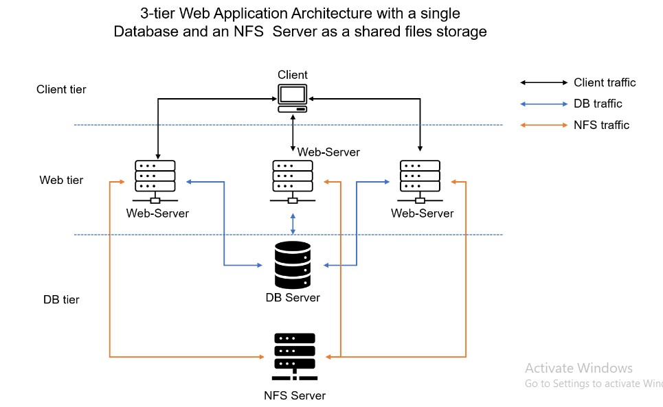

# Project 7: Tooling Website Solution
### In this project I implemented a DevOps tooling webiste solution, a 3 tier web application architecture with a simple database and a NFS server as a shared file storage.
### This project gives hands-on experience working with partitions and logical volumes, the different types of storage solutions and when they are most suitabe to be used, network storage protocols (NFS) as well as working with databases.

