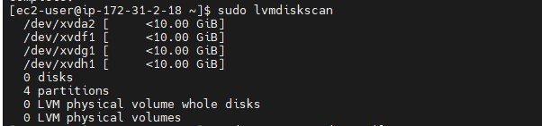
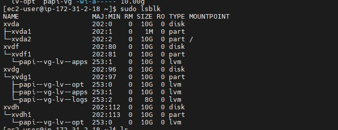
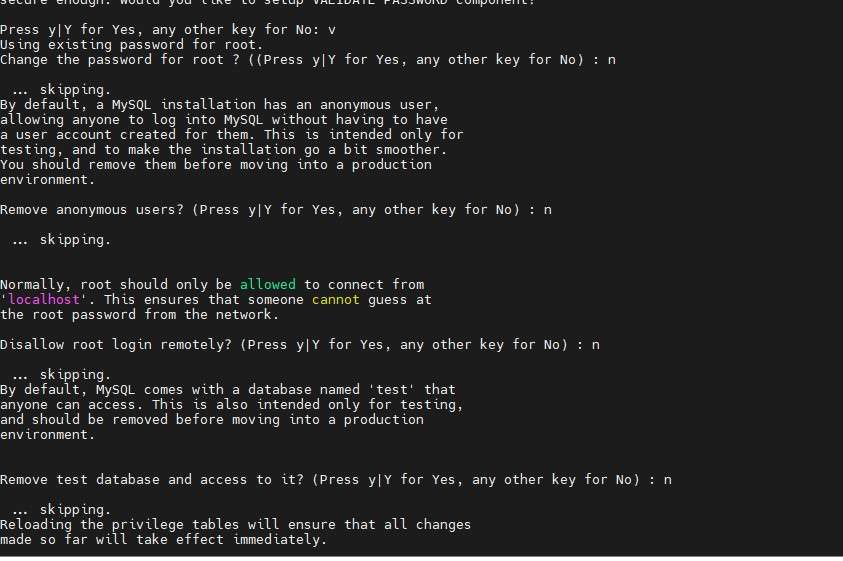
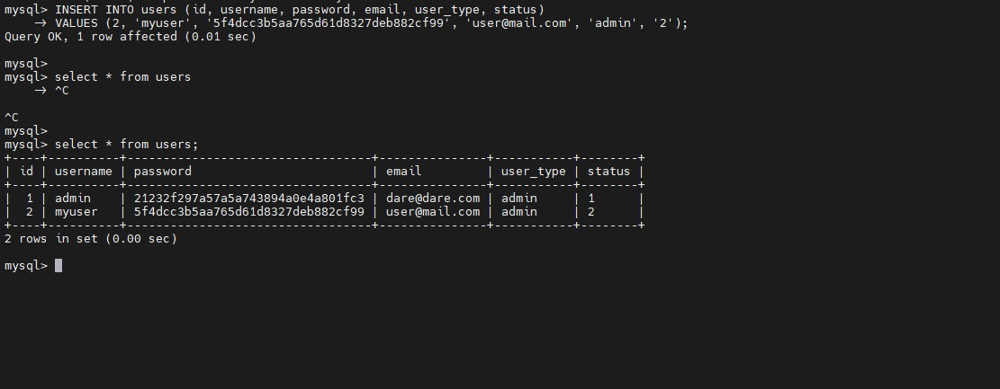

# Implementing a Tooling Website Solution
## STEP 1: Prepare NFS Server

### Launch a server(Redhat OS), create 3 volumes in the same AZ as your instances.(10GiB). Proceed to attach all 3 volumes one by one to your web server instance
```create volumes```


### When attaching the volume ensure your web server is in the same AZ as the volume


### use the $lsblk command to see all block devices attached to the server. Your newly added block devices xvdf, xvdg and xvdh should be there


### Use gdisk to create a single partition of each of the 3 disks. i.e xvdf, xvdg, xvdh

```ts
sudo gdisk /dev/xvdf

sudo gdisk /dev/xvdg

sudo gdisk /dev/xvdh
```

### Use $lsblk to view the new configured partitions o the 3 disks.


### Install lvm2 package and proceed to check for all available partitions
`sudo yum install lvm2`

`sudo lvmdiskscan`



### mark each of the 3 disks as physical volume(PVs) to be used by LVM with pvcreate. Verify that the PVs were created
```
sudo pvcreate /dev/xvdf1
sudo pvcreate /dev/xvdg1
sudo pvcreate /dev/xvdh1
```
`sudo pvs`


### Add all 3 PVs to a volume group(VG) named "papi-vg" using vgcreate utility and verify the this.
`sudo vgcreate papi-vg /dev/xvdh1 /dev/xvdg1 /dev/xvdf1`

`sudo vgs` 


### create 3 logical volumes;  lv-opt(to be used by Jenkins server), lv-apps (to be used by webservers)and lv-logs(to be used by webserver logs). $sudo lvs to view everything
`sudo lvcreate -n lv-opt -L 10G papi-vg`

`sudo lvcreate -n lv-apps -L 10G papi-vg`

`sudo lvcreate -n lv-logs -L 8G papi-vg`

`sudo lvs`


### view your entire setup
`sudo vgdisplay -v #view complete setup - VG, PV, and LV
sudo lsblk`


### ### Format both logical volumes with the xfs file system
`sudo mkfs -t xfs /dev/papi-vg/lv-apps`
`sudo mkfs -t xfs /dev/papi-vg/lv-opt`
`sudo mkfs -t xfs /dev/papi-vg/lv-logs`


### Create mount points for the logical volumes in the mount directory
```
Mount lv-apps on /mnt/apps – To be used by webservers
Mount lv-logs on /mnt/logs – To be used by webserver logs
Mount lv-opt on /mnt/opt – To be used by Jenkins server
```
`sudo mount /dev/papi-vg/lv-apps /mnt/apps`
`sudo mount /dev/papi-vg/lv-logs /mnt/logs`
`sudo mount /dev/papi-vg/lv-opt /mnt/opt`

### Install NFS server, configure it to start on reboot and make sure the service is running
```
sudo yum -y update
sudo yum install nfs-utils -y
sudo systemctl start nfs-server.service
sudo systemctl enable nfs-server.service
sudo systemctl status nfs-server.service
```
### Set ownership and read write execute permissions that will allow your Web servers to read, write and execute files on NFS.
```
sudo chown -R nobody: /mnt/apps
sudo chown -R nobody: /mnt/logs
sudo chown -R nobody: /mnt/opt

sudo chmod -R 777 /mnt/apps
sudo chmod -R 777 /mnt/logs
sudo chmod -R 777 /mnt/opt

sudo systemctl restart nfs-server.service
```


### the /etc/exports is a main configuration file that controls which file systems are exported to remote hosts. Since in this project you will be creating your webservers in the same subnet as your NFS server Edit this file and add the directories you wish the NFS clients to access as well as the subnet CIDR i.e you are configuring access to NFS for clients within the same subnet. Instead of subnet CIDR it can be the client Ip-address or hostname.

`sudo vi /etc/exports`
```
/mnt/apps <Subnet-CIDR>(rw,sync,no_all_squash,no_root_squash)
/mnt/logs 172.31.0.0/20(rw,sync,no_all_squash,no_root_squash)
/mnt/opt 172.31.0.0/20(rw,sync,no_all_squash,no_root_squash)  
```
### Show directories being exported and the clients
`sudo exportfs -arv`

## NOTE: exportfs command: 
### exportfs -v Displays a list of shared files and options on a server
### exportfs -a Displays all directories listed in /etc/exports
### exportfs -u Unexport one or more directories 
### exportfs -r Reexport all directories after modifying /etc/exports

### Check which port is used by NFS and allow inbound traffice to the port from your security group. Also note that in order for NFS server to be accessible from your client, you must also open following ports: TCP 111, UDP 111, UDP 2049

`rpcinfo -p | grep nfs`


## STEP 2: Configure the Database server
### Install mysql on Database server
`sudo yum update`
`sudo yum install mysql-server`
`sudo systemctl restart mysqld`

`sudo systemctl enable mysqld`


# configure DB to work with wordpress
`sudo mysql`

### set password for user root 
`ALTER USER 'root'@'localhost' IDENTIFIED WITH mysql_native_password BY 'password';`

`exit`

### Run a recommended security script to remove some insecure settings and restrict access. The script prompts you to:
- Configure validate password plugin
- Remove anonymous users?
- Disallow root login remotely?
- Remove test database and access to it?
- Reload privilege tables now?
### Choose No for all except no 2

`sudo mysql_secure_installation`


### Create database named "tooling" and a user "webaccess" and grant the user "webserver all privileges to the database"
`sudo mysql -p`
`CREATE DATABASE tooling;`


`CREATE USER 'webaccess'@'172.31.80.0/20' IDENTIFIED WITH mysql_native_password BY 'webman';`


### Switch to the database and grant access to the user "webaccess"

`use tooling` 

`GRANT ALL PRIVILEGES ON *.* TO 'webaccess'@'172.31.80.0/20' WITH GRANT OPTION;`

`FLUSH PRIVILEGES;`

### See all users and hosts
`select user, host from mysql.user;`


`SHOW DATABASES;`

`exit`


### Configure MySQL server to allow connections from remote hosts i.e set the bind address
`sudo vi /etc/my.cnf`


### Restart the service
`sudo systemctl restart mysqld`

## STEP 3: Prepare the webservers
### The goal is to ensure your webservers can serve the same content from the same shared storage i.e NFS server and Mysql database. A database can already be accessed by multiple clients for reads and writes. Apache stores files that it serves users in the /var/www/. Since you want all your webservers to serve the same content, you use an NFS and mount the previosuly created logical volume ""lv-app" to the directory where apache serves files from i.e /var/www/ 
### This will make your webservers stateless i.e you will be able to add new ones and remove them as you please and the integrity of your data both in the database and the NFS will be preserved.
### Install mysql
`sudo yum install mysql -y`


### Install nfs clients on all 3 webservers
`sudo yum install nfs-utils nfs4-acl-tools -y`

### Create a directory /var/www and mount it to the NFS server's export for apps
```
sudo mkdir /var/www

sudo mount -t nfs -o rw,nosuid <NFS-Server-Private-IP-Address>:/mnt/apps /var/www
```
### Verify that the mount was successful on the 3 servers
`df -h`


### Edit the /etc/fstab to make sure the mount persists on reboot
`sudo vi /etc/fstab`
`<NFS-Server-Private-IP-Address>:/mnt/apps /var/www nfs defaults 0 0`


### Install Remi’s repository, Apache and PHP

`sudo yum install https://dl.fedoraproject.org/pub/epel/epel-release-latest-8.noarch.rpm`

`sudo yum install yum-utils http://rpms.remirepo.net/enterprise/remi-release-8.rpm`

`sudo yum module list php`

`sudo yum module reset php`

`sudo dnf module enable php:8.0`
`sudo dnf module -y install php:8.0/common`

`sudo yum install php php-opcache php-gd php-curl php-mysqlnd`

`sudo systemctl start php-fpm`

`sudo systemctl enable php-fpm`

`setsebool -P httpd_execmem 1`

### Restart apache
`sudo systemctl restart httpd`

### Verify that apache has been installed, Locate the log folder for Apache on the Web Server and mount it to NFS server’s export for logs and edit the /etc/fstab file for persistence

` sudo mount -t nfs -o rw,nosuid 172.31.13.130:/mnt/logs /var/log/httpd`


### In your home folder, install git and run git init and clone the webiste repo
`sudo yum install git`
`git init`
`git clone https://github.com/NyerhovwoOnitcha/tooling.git`


### Deploy the tooling website’s code to the Webserver. Ensure that the html folder from the repository is deployed to /var/www/html

`sudo cp -R tooling/html/. /var/www/html`


### Open port 80 on your web server and disable SELINUX
`sudo setenforce 0`

### Make this permanent by opening the config file sudo vi /etc/sysconfig/selinux and set SELINUX=disabled.
`sudo vi /etc/sysconfig/selinux`


### Restart httpd
`sudo systemctl restart httpd`

### restart httpd
`sudo systemctl restart httpd`

### Update the website configuration in /var/www/html/functions.php so it can connect to the database. On the connect to database section, put in your database IP-address, database user and password.
`sudo vi /var/www/html/fucntions.php`


### Apply tooling-db.sql script to your database
```
mysql -h <databse-private-ip> -u <db-username> -p <db-name> < tooling-db.sql

mysql -h 172.31.3.139 -u webaccess -p tooling < tooling-db.sql
```

### Try to connect from your webserver to your Database from your command line
`sudo mysql -u <DB username> -p -h <DB server private address>`

`sudo mysql -u webaccess -p -h 172.31.3.139`


### Create in MySQL a new admin user with username: myuser and password: password
`INSERT INTO users (id, username, password, email, user_type, status)`

` -> VALUES (2, 'myuser', '5f4dcc3b5aa765d61d8327deb882cf99', 'user@mail.com', 'admin', '2');`



### Login your website with the new admin user created


